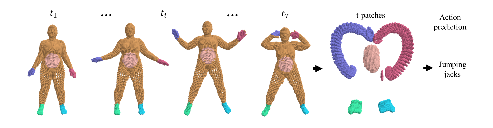

***3DInAction***: Understanding Human Actions in 3D Point Clouds
---
Created by [Yizhak Ben-Shabat (Itzik)](http://www.itzikbs.com)<sup>1, 2</sup>, Oren Shrout<sup>1</sup> and [Stephen Gould](http://users.cecs.anu.edu.au/~sgould/)<sup>2</sup>

<sup>1</sup>[Technion](https://www.technion.ac.il/), <sup>2</sup>[ANU](https://www.anu.edu.au/)

__[Project page](https://sitzikbs.github.io/3dinaction.github.io/)&nbsp;| [Arxiv](https://arxiv.org/pdf/)__



## Introduction
This is the code for the 3DInAction paper for 3D point cloud action recognition.
It allows to train, test and evaluate the tasks of per-frame and per-clip action classification.

Please follow the installation instructions below.

## Instructions

### 1. Requirements
The code was tested with python 3.8.16 torch 1.10.1 and CUDA 11.3.

```
sh
conda create -n tpatches_env python=3.8.16
conda activate tpatches_env
conda install pip #for using pip commands in the conda environments
# Install with instructions from https://pytorch.org/get-started/locally/
# Below is instructions for installation of long term support
conda install pytorch==1.10.1 torchvision==0.11.2 torchaudio==0.10.1 cudatoolkit=11.3 -c pytorch -c conda-forge
#Then install all other requirements
pip install -r requirements.txt
```
Then compile the pointnet2 modules for FPS:
```
cd ./models
python setup.py install
```

We use `wandb` for tracking our experiments (losses accuracy etc.)
so you may need to either [set up an account](https://wandb.ai/site) or comment out the logging code lines.

### 2. Datasets

We evaluate on three datasets:
1. [DFAUST](https://dfaust.is.tue.mpg.de/) (~3.4GB)
2. [IKEA ASM](https://drive.google.com/file/d/12u5YQqsB5L1H1BYzvu2HVDTyeAze4b1w/view?usp=share_link) (~117GB)
3. [MSR-Action3D FPS](https://drive.google.com/file/d/1ffSQyjbaX32vRs26M9Hhw0nE2HMrUTSV/view?usp=share_link) (200MB)

Download the datasets, extract the `.zip` file and update the `dataset_path` in the `.config` file under `DATA`.

When using these datasets, make sure to cite their papers [DFAUST](https://scholar.googleusercontent.com/scholar.bib?q=info:RGX6IrpU2ooJ:scholar.google.com/&output=citation&scisdr=CgXc00R2ELeUhYL40-g:AAGBfm0AAAAAZA3-y-go0ts9juJTP1DBOg5lUNfn5zMH&scisig=AAGBfm0AAAAAZA3-y2KXFBjO0VPfoWGEy7NuvRbSZGf0&scisf=4&ct=citation&cd=-1&hl=en),
[IKEA ASM](https://scholar.googleusercontent.com/scholar.bib?q=info:hCKBKB3YslAJ:scholar.google.com/&output=citation&scisdr=CgXc00R2ELeUhYL48sg:AAGBfm0AAAAAZA3-6siLLe4GCEF2f4SPhC22Iy9pUrl-&scisig=AAGBfm0AAAAAZA3-6uWOEcWQGHrgs7ksJs_1lyndHKQ9&scisf=4&ct=citation&cd=-1&hl=en),
[MSR-Action3D](https://scholar.googleusercontent.com/scholar.bib?q=info:-qB118Rs36gJ:scholar.google.com/&output=citation&scisdr=CgXc00R2ELeUhYL5DTY:AAGBfm0AAAAAZA3_FTbAEFhuDkThjAK4_zxwo92ke8b6&scisig=AAGBfm0AAAAAZA3_FX3kgKltmprj2akmnWBi_2HZTzfZ&scisf=4&ct=citation&cd=-1&hl=en).

### 3. Train, test and evaluate

To train, test and evaluate with the default settings run

```sh run_experiment.sh```

For a customized model, edit the `.config` file.
Examples for different configurations are available in the `configs` directory.


## Acknowledgements

This project has received funding from the European Union's Horizon 2020 research and innovation
programme under the Marie Sklodowska-Curie grant agreement No 893465.
We also thank the NVIDIA Academic Hardware Grant Program for providing high-speed A5000 GPU

## License and Citation

This paper was accepted to CVPR 2024 (the citation will be updated once CVF makes the paper public).

If you find our work useful in your research, please cite our paper:

[Preprint](http://arxiv.org/abs/2303.06346/):
```bibtex
{
@article{benshabat2023tpatches,
  title={3DInAction: Understanding Human Actions in 3D Point Clouds},
  author={Ben-Shabat, Yizhak and Shrout, Oren and Gould, Stephen},
  journal={arXiv preprint arXiv:2303.06346},
  year={2023}
}
```

See [LICENSE](https://github.com/sitzikbs/3dincaction/blob/main/LICENCE) file.
